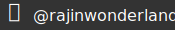

# badgesauce

## Background

Just made some badges on sketch for fun!

Don't plan on updating this very much.

The badges currently aren't dynamic or anything.

# badgesauce

## Background

Just made some badges on sketch for fun!

Don't plan on updating this very much.

The badges currently aren't dynamic or anything.

## Badges

Feel free to reuse!

> Large Badges

> Social Badges

